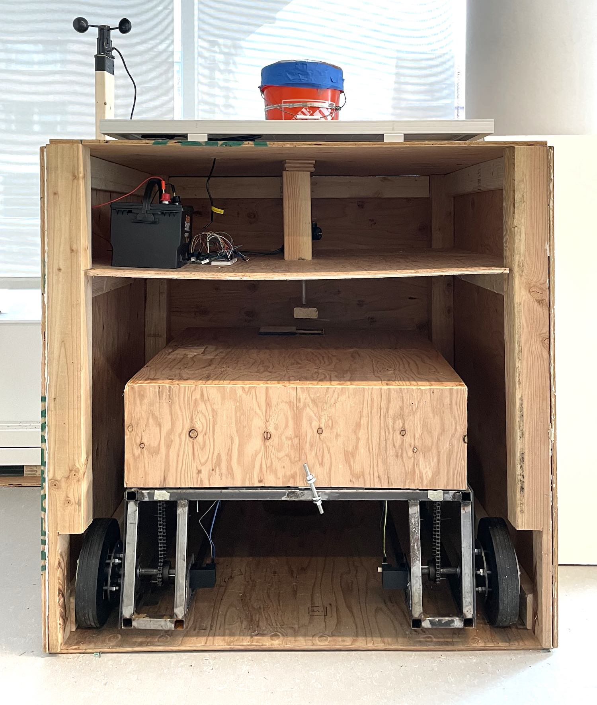
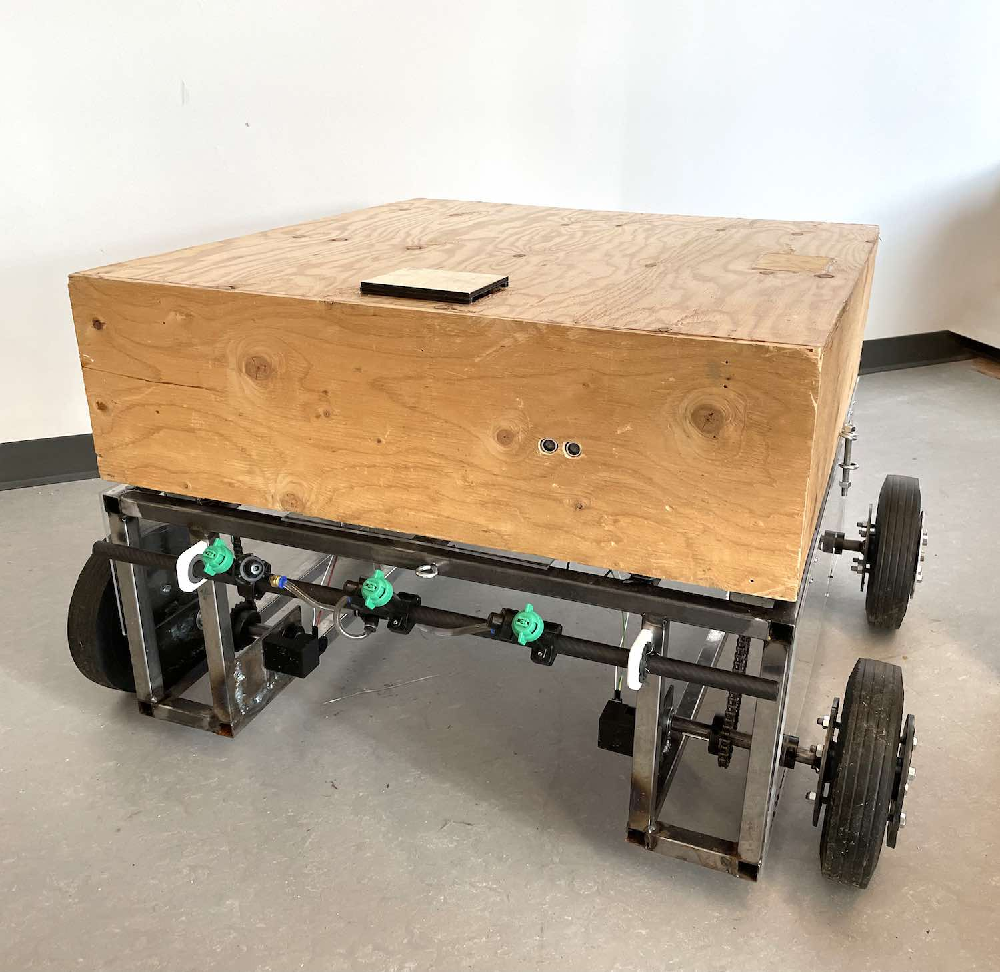
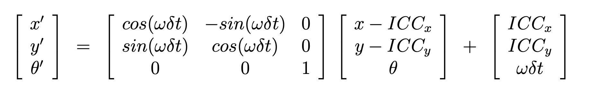
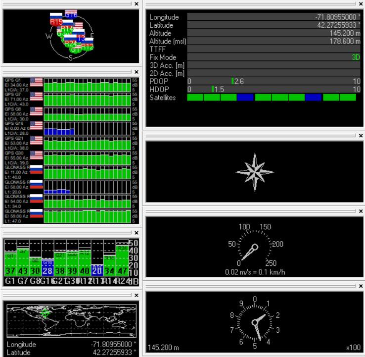
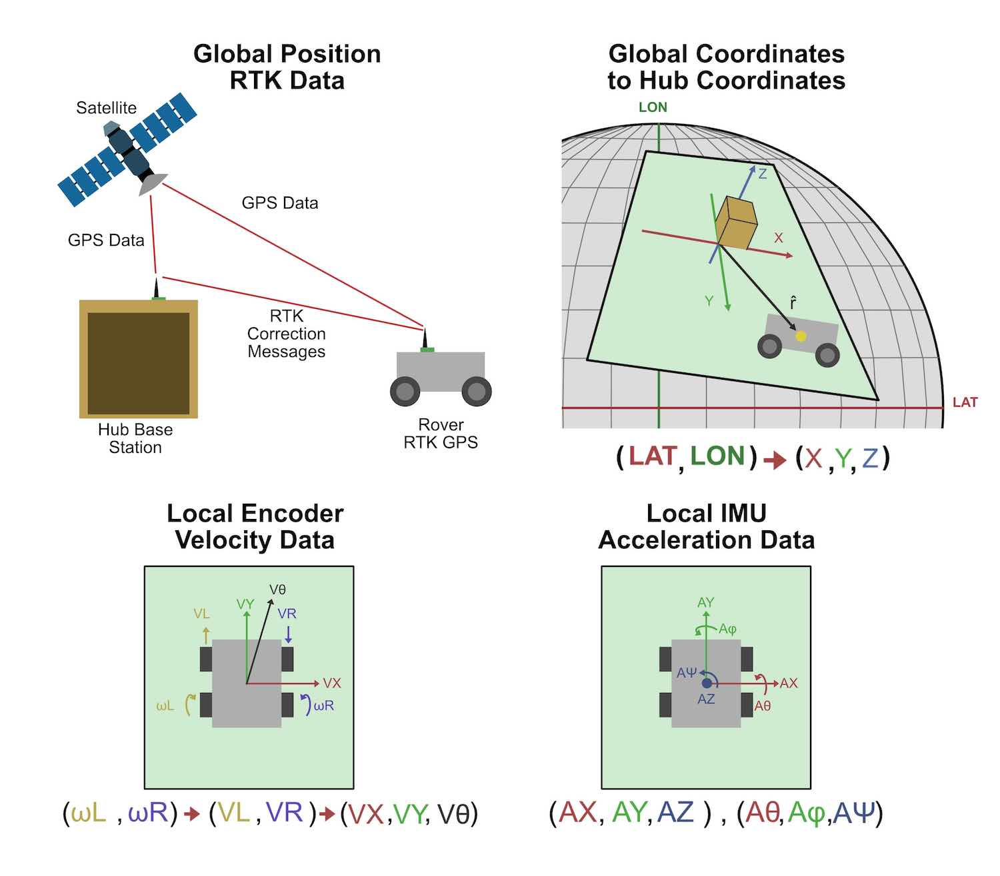
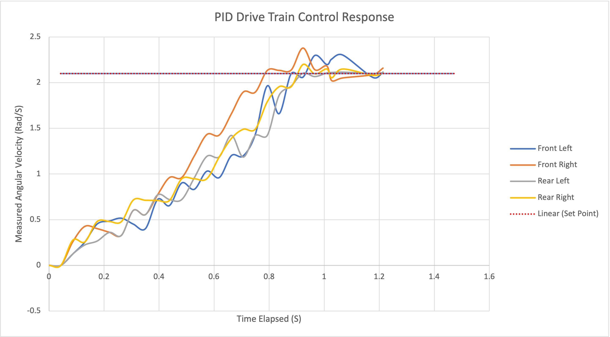

# Agribots
Codebase written for WPI Solar Agribots MQP Project 2021-2022.

# Hub

## Receiver
## Transmitter
## Soil_Sensor

# Rover

## Encoders
## IMU

## GPS

## Localization

## Motors
## Controls

## Main_ROver
